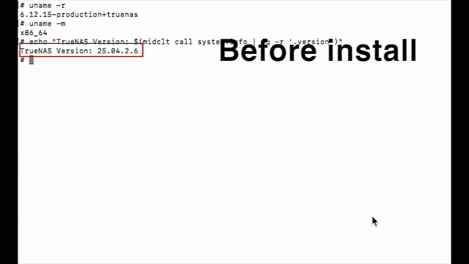

# TrueNAS NVIDIA driver raw builder (sysext builder)



```bash
# on your truenas host, run

curl -fsSL https://raw.githubusercontent.com/binary-person/truenas-nvidia-raw-builder/refs/heads/main/easy.sh -o easy.sh && chmod +x easy.sh && sudo ./easy.sh

# if it doesn't have the truenas + nvidia driver version, read on to understand how to build one for yourself
```

## Use cases

Primarily, you want to install a different driver than the included nvidia driver with TrueNAS without breaking your TrueNAS. Several reasons why you would want to:

- A docker image you want to use only supports a certain newer/older CUDA version
- You want to use nvidia gpus not supported by the open kernel drivers, such as pascal on 25.10
- You want to use blackwell nvidia gpu on 25.04

## Prebuilt docker image and notes

- scale-build's `make checkout` and `make packages` take a long time especially when building the kernel, so I pushed images for your convenience. To use, skip over to the docker run command step and replace `truenas-nvidia-raw-builder` with `binaryperson/truenas-nvidia-raw-builder:25.04.2.6` or with the below version numbers:
  - `25.04.2.6`, `25.10.2.2`

- When building, the step `Setting up bootstrap directory` may take 10+ mins. For me it took 13 mins. `Building 'kernel' package` took 1 hour 20 mins

## How to build your own driver if easy.sh doesn't have the truenas+nvidia driver

As an example, commands will be targeting Truenas 25.04.2.6 building for Nvidia driver `580.142`

Random fact: 580.x is the last Linux driver branch that supports Maxwell, Pascal, and Volta GPUs

```bash

# clone repo
git clone https://github.com/binary-person/truenas-nvidia-raw-builder
cd truenas-nvidia-raw-builder

# build environment for TrueNAS 25.04.2.6 (will take a few hours if there isn't one built already)
# see available versions by going to https://github.com/truenas/scale-build/tags
# fyi, 25.10 is "TrueNAS-SCALE-Goldeye"
TRUENAS_VERSION=25.04.2.6 TRUENAS_TRAIN=TrueNAS-SCALE-Fangtooth ./devops-build-script-combined.sh

# build for nvidia driver 580.142 with open kernel modules (use this if your gpu is blackwell or rtx 50 series)
TRUENAS_VERSION="25.04.2.6" \
  NVIDIA_VERSION="580.142" \
  NVIDIA_MODULE_TYPE="open" \
  ./devops-nvidia.sh

# build for nvidia driver 580.142 with proprietary kernel modules
TRUENAS_VERSION="25.04.2.6" \
  NVIDIA_VERSION="580.142" \
  NVIDIA_MODULE_TYPE="proprietary" \
  ./devops-nvidia.sh

# specify custom run url
docker run --rm --privileged \
  -e NVIDIA_DRIVER_RUN_URL="https://download.nvidia.com/XFree86/Linux-x86_64/580.142/NVIDIA-Linux-x86_64-580.142.run" \
  -e NVIDIA_KERNEL_MODULE_TYPE=open \
  -v "$PWD/out:/out" \
  binaryperson/truenas-nvidia-raw-builder:25.04.2.6

# see available nvidia drivers here:
# https://download.nvidia.com/XFree86/Linux-x86_64/
```

## After build

Files should be in

```text
out/nvidia.raw
out/rootfs.squashfs
out/nvidia.raw.sha256
```

## How to use .raw

On your TrueNAS host (example uses 25.04.2.6. replace with your own):

```bash
midclt call docker.update '{"nvidia": false}' >/dev/null
systemd-sysext unmerge
zfs set readonly=off boot-pool/ROOT/25.04.2.6/usr

# backup your original nvidia.raw
cp -n /usr/share/truenas/sysext-extensions/nvidia.raw nvidia_backup.raw

# copy your newly built nvidia.raw
cp nvidia.raw /usr/share/truenas/sysext-extensions/nvidia.raw

systemd-sysext merge
midclt call docker.update '{"nvidia": true}' >/dev/null

# unload previous loaded nvidia drivers (may have to run this set of commands twice)
rmmod nvidia_uvm
rmmod nvidia_drm
rmmod nvidia_modeset
rmmod nvidia

# check new version
nvidia-smi
```


## Extra notes

- See a list of prebuilt nvidia.raw files in Releases
- All the credit goes to: https://www.homelabproject.cc/posts/truenas/truenas-build-nvidia-vgpu-driver-extensions-systemd-sysext/
- This project basically just dumbs the above guide down to using docker commands to build it.
- Tested on 25.04. Likely works on 25.10.
- Version compatibility hinges on how much the scale_build/extensions.py file changes and if there are any changes to build commands.
- Link to scale_build/extensions.py 25.04: https://raw.githubusercontent.com/truenas/scale-build/refs/heads/release/25.04.2.6/scale_build/extensions.py
